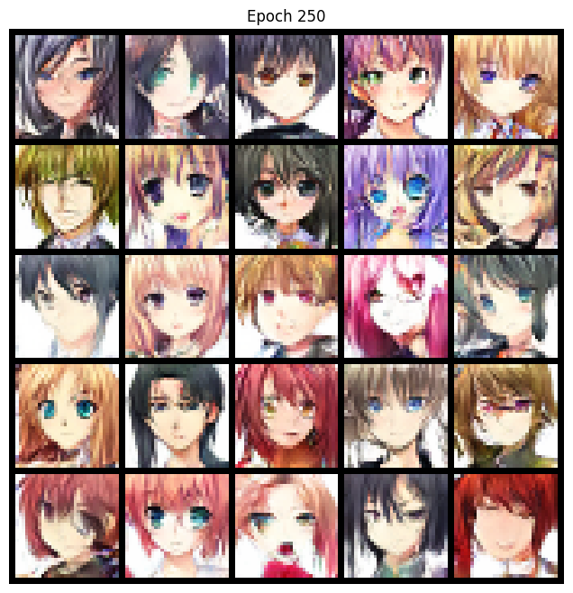

# 🎨 Anime Character Generator using Deep Convolutional GAN (DCGAN) with Regularizations

> **Notebook:** `dc-gan-v2.ipynb`  
> **Framework:** PyTorch  
> **Model Type:** Deep Convolutional GAN (DCGAN)  
> **Dataset:** `[ anime faces dataset from Kaggle  ](https://www.kaggle.com/datasets/soumikrakshit/anime-faces)`

## 🧠 Background & Motivation

Ever wondered how Anime artists get inspiration for creating new Anime Characters? Every year, around 300 anime are produced with numerous distinct characters. To aid in this creative process, many artists have started exploring **Generative Adversarial Networks (GANs)** to generate and inspire anime character designs.

This project is an implementation of a **Deep Convolutional GAN** trained on anime face images, aiming to generate unique and nostalgic anime-style characters that resemble those from early 2000s games.

---

## 🛠️ Technical Overview

### Model Architecture
- **Generator**: Uses transposed convolution layers with spectral normalization and batch normalization.
- **Discriminator**: Standard CNN architecture with LeakyReLU activations, dropout regularization (25%), and no spectral normalization.

### Key Techniques Implemented
- ✅ **Spectral Normalization** in generator layers for stable training.
- ✅ **Dropout (25%)** in discriminator to prevent overfitting.
- ✅ **Label Smoothing**:
  - Real labels: `0.9` instead of `1.0`
  - Fake labels: `0.1` instead of `0.0`
- ✅ **Exponential Learning Rate Decay** for both generator and discriminator after epoch 50.
- ✅ Training frequency control: Discriminator updated less frequently than generator to avoid overpowering it.

---

## 📦 Dataset

- Source: `[/kaggle/input/anime-faces/data](https://www.kaggle.com/datasets/soumikrakshit/anime-faces)`
- Processed using custom loader to ensure RGB format and resized to `32x32`.
- Transformed with normalization (`[-1, 1]` range via mean and std of 0.5).

---

## ⚙️ Hyperparameters

| Parameter           | Value             |
|---------------------|-------------------|
| Latent Dimension     | 128               |
| Image Size           | 32x32             |
| Batch Size           | 64                |
| Epochs               | 200               |
| Optimizer            | Adam              |
| Generator LR         | 0.0002            |
| Discriminator LR     | 0.0001            |
| Betas                | (0.5, 0.999)      |
| Device               | CUDA if available |

---

## 📈 Training Insights

- The model was initially trained as a basic GAN but showed poor results.
- Switching to **DCGAN** improved texture and sharpness.
- Further improvements came with **regularization techniques**, though generated images were still not photorealistic.
- Final outputs resemble **nostalgic anime characters** reminiscent of early 2000s video game aesthetics.

---

## 🖼️ Sample Output at Epoch 200

Each grid shows 25 generated anime face samples created by the generator using random latent vectors.

---

## 📁 Files Included

- `dc-gan-v2.ipynb`: Main Jupyter Notebook with full implementation.
- `results dc-gan`: Generated image grids saved after some epochs of DC-GAN. (folder)
- `results` : Generated image grids saved after some epochs of GAN. (folder)
- `epoch_250` : generated Image grid when epoch = 250
- `initial attempts` : Former versions of GAN and DC-GAN
- `README.md`: This file.

---

## 💬 Acknowledgements

Inspired by the creativity of anime artists and powered by the potential of deep generative models. Special thanks to Kaggle for hosting the anime faces dataset.

---

## 📚 References

- Goodfellow et al. - Generative Adversarial Networks (2014)
- Radford et al. - Unsupervised Representation Learning with Deep Convolutional GANs (2015)
- Miyato et al. - Spectral Normalization for GANs (2018)

